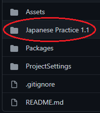

# Japanese Practice
This project is a Japanese language learning practice tool built using the Unity engine. It helps users practice very basic concepts like Hiragana (ひらがな), Katakana (カタカナ) and some basic Kanji (感じ) and phrases. Users can practice memorizing how to pronounce the various symbols, and memorize which symbol represents various romanji. Users are also able to test their skills in the challenge mode where they can gain points by identifying the correct pronunciation in the given time.

## Installation
This project is extrememly simple to install and use on your Windows system. First, navigate to the branches on the github page.

Select the `Tags` option

Locate the latest verion of the App

Navigate to that version and fork the repository. The only folder you need to worry about is the `"Japanese Practice [version number]"` folder. This will contain the executable file for the app and all of the files it needs to run.

The folder with the application can be installed and run anywhere you desire on your machine.

## Usage
After launching the application, you should see the main menu which will look like this:

From there you can run the application and practice your Japanese skills! 
